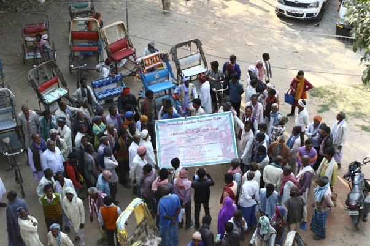

---
author:
date: "2019-07-01"
draft: false
excerpt: I contributed in multiple capacities to this two-year long participatory public consultation project that delivered a draft for state-level cycle rickshaw bill and filled the knowledge gap that previously crippled policy actions on the subject.
layout: single
links:
- icon: globe
icon_pack: fas
name: website
external_url: https://www.sumnet.in/cycle-rickshaw-bill-advocacy-pedals-ahead/
subtitle: 2017-2019
tags:
- urban mobility
- campaign
- non-motorised transport
- policy
- Bihar
- Jharkhand

title: Draft Bill for Cycle Rickshaw in Bihar and Jharkhand
---

I contributed in multiple capacities to this two-year long participatory
public consultation project that delivered a draft for state-level cycle
rickshaw bill and filled the knowledge gap that previously crippled
policy actions on the subject. Here is a summary of the project:

## Aim

-   To advocate for drafting and implementing a law to protect the interests of cycle rickshaw drivers in Bihar and Jharkhand.

-   To bring recognition to the role of cycle rickshaw in providing accessible livelihood opportunity and a sustainable mode of transport in cities and towns of Bihar/Jharkhand.

## Process

The project team conducted more than a hundred meetings during 2017-19 covering all major towns of Bihar and Jharkhand. The process had kick-started with  a state-level preparatory meeting of facilitators in Patna where the methods of ensuring a robust participatory processes in policy making was deliberated upon.

In all the town-level meetings with stakeholders which we organised, we focused on two key questions:

-   What are the challenges of cycle rickshaw as a mode of sustainable transport from the perspectives of drivers, users, planners and industry stakeholders?

-   How the working conditions and quality of life of cycle rickshaw drivers can be improved?

The town-level meetings were attended by a range of stakeholders including cycle rickshaw drivers, rickshaw owners, rickshaw mechanics, union representatives, political party representatives, and government officials.

The process was anchored by Rajendra Ravi (Institute for Democracy and Sustainability, Delhi) and mentored by Raju Bhise (Yuva, Mumbai), Sanskrit Menon (Centre for Environment Education, Pune) and Nishant Singh (IIT Delhi). Advocacy team received various suggestions concerning the issues of licensing of cycle rickshaws, fare structure, cycle rickshaw zones and exclusive lanes/ networks, parking for cycle rickshaws, social security measures for rickshaw drivers and so on.

## Output

A [draft Cycle Rickshaw (Protection of Livelihood, Promotion of Sustainable and Eco-friendly mobility)
Act](https://www.sumnet.in/wp-content/uploads/2018/02/Cycle-Rickshaw-Bill_Draft.docx.pdf) was prepared with the contribution of [Alternative Law Forum, Bangalore](https://altlawforum.org/about/) that incorporated most, if not all, of the knowledge and feedback that was generated from the ground work and consultations.

## Supported By

-   [Sustainable Urban Mobility Network (SUM Net)
    India](https://www.sumnet.in)
