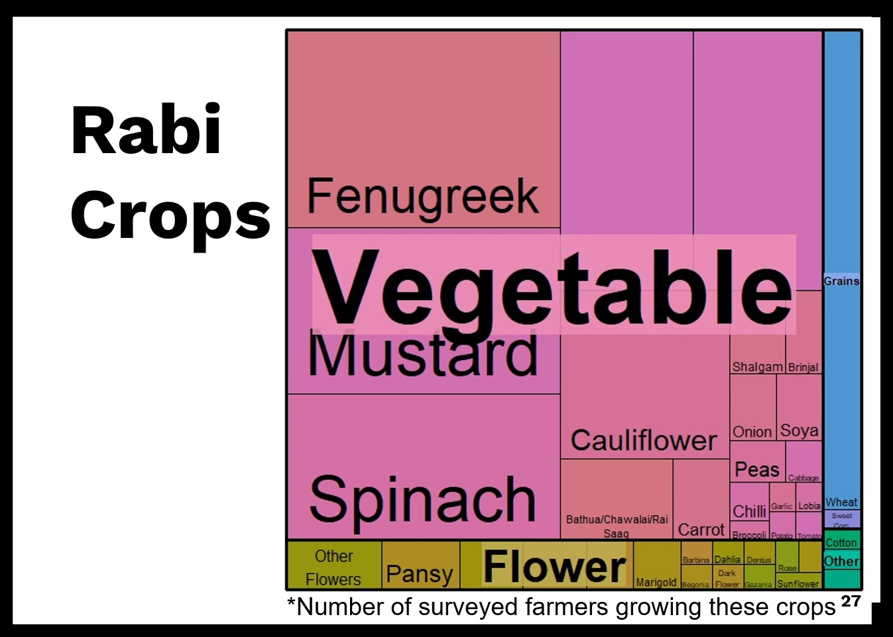

---

date: "2023-01-12"
draft: false
excerpt: As a co-founder of this social initiative, I built a research and advocacy program from scratch that covered a lot of different topics, like urban mobility, urban agriculture, urban rivers and waterfronts, democratizing urban local government, and climate justice. Among my accomplishments was establishing more in-depth and impacting engagements with prominent media agencies, policy-makers, scholars, civil society organisations and citizens alike.
layout: single-sidebar
show_author_byline: false
show_button_links: true
show_post_date: true
show_post_thumbnail: true
sidebar:
  #author: The R Markdown Team @RStudio
  description: Draft of the citizen's policy on urban agriculture in Delhi was prepared by a working group comprising of urban farmers, researchers, and representatives of Delhi-based social and environmental organisations. [Akshita Rawat](https://www.linkedin.com/in/akshita-rawat-ba45611a5/) and I steered the year-long participatory process.   In the photograph (left to right)- Paras Tyagi (Centre for Youth, Culture and Law), Anita Pinheiro (JNU Delhi), and Akshita Rawat      
  show_sidebar_adunit: false
  title: ""
  show_outro: true
  outro:  Draft of the citizen's policy on urban agriculture in Delhi was prepared by a working group comprising of urban farmers, researchers, and representatives of Delhi-based social and environmental organisations. [Akshita Rawat](https://www.linkedin.com/in/akshita-rawat-ba45611a5/) and I steered the year-long participatory process.   In the photograph (left to right)- Paras Tyagi (Centre for Youth, Culture and Law), Anita Pinheiro (JNU Delhi), and Akshita Rawat 
subtitle: A Research and Action Initiative for Social Transformation   
tags:
- projects
- advocacy
- social movement
- urban mobility
- urban agriculture
- program management
- another city is possible
show_outro: true
outro:  Draft of the citizen's policy on urban agriculture in Delhi was prepared by a working group comprising of urban farmers, researchers, and representatives of Delhi-based social and environmental organisations. [Akshita Rawat](https://www.linkedin.com/in/akshita-rawat-ba45611a5/) and I steered the year-long participatory process.   In the photograph (left to right)- Paras Tyagi (Centre for Youth, Culture and Law), Anita Pinheiro (JNU Delhi), and Akshita Rawat 
title: People's Resource Centre
---

## [People's Resource Centre](http://prcindia.in) was started as an initiative for creating conditions and infrastructures so that a fairer, better system emerges out of the existing one.  

---

Though my association with this project has ended since late 2022, it remains a special project that I had co-built with many other young, passionate people during 2019-2022. What seems like a small initiative was essentially an attempt in dealing with big questions of our time through a process informed by extraordinary evidence but powered by ordinary people. 

### Functions
Our team at PRC conducted action-oriented research and specialised in grounded approach to empowering community-led interventions.    We published knowledge material on myriad subjects in Indian urban context to de-clutter the common understanding of how the processes of exploitation and expropriation are going on and who stand to benefit from them.   I also anchored the translation initiative under which we republished a series of forgotten or less-known texts that remain relevant to contemporary social movements.    Among many beautiful ideas that our team came up with and worked upon, [Beejpatra](https://prcindia.in/category/publications/beejpatra/) remains a favourite. I conceptualised and co-edited multiple editions of this unique journal over two years. All the editions are publicly available for reading and sharing freely.  

### Achievements
During these years, I co-created primary research-based knowledge that could inform our collective understanding of many socially relevant "urban" problems, some of which were:  
- [How metro rail projects are threatening urban resources in Indian cities](https://prcindia.in/page/1/?s=metro)
- [Present, past and future of urban agriculture in cities across India](https://prcindia.in/?s=urban+agriculture)
- [Why there are so many river-fronts being built on urban stretches of already sick rivers in India, and what to do about that](https://prcindia.in/?s=river)  
- [How to localize and democratize urban local governance in India to make another city possible](https://prcindia.in/?s=another+city+is+possible)
  
### Highlights


 Co-researcher(s): [Aakiz Farooq](https://www.linkedin.com/in/aakiz-farooq-88b83a49)   
  Another City Is Possible but not until we dare to reimagine the governance structures and get over with top-heavy processes of urban planning. 
  
To build the power of imagining a different kind of just and free city, I conceptualised this series of research and seminars about the ideas that will make those another cities possible. We brought into our discussion indigenous and global experiences of direct democracy, municipalism, mutual aid during COVID and otherwise, and more.
  
|       |
|--------------|-----------|------------|
 
Design credit: [Avikal](https://www.avikal.in/) 


Co-contributors:  Akshita Rawat,  Avikal, Deborah Dutta, Geetanjali Gurlhosur, and Mohini (who had actually come up with the name in 2020)
  
Beejpatra in Hindi translates as ‘cotyledons’- the part of the seed which nourishes it till it grows its own roots. It also translates as “the original letter”.  We had started this journal as an attempt to explore urban farming as a step towards realizing the hope of better, fairer and fundamentally different cities.   

 
Co-editors: Akshita Rawat and Chayanika  
Design credit: Lakshay  
  
Co-editor(s): [Deborah Dutta](https://lsr.hbcse.tifr.res.in/people/deborah-dutta/), Akshita Rawat
Design credit: [Avikal](https://www.avikal.in/)   
All the lovely illustrations in this edition were done by Deborah with such grace at our shameless request. :)    


Co-researcher(s): [Aakiz Farooq](https://www.linkedin.com/in/aakiz-farooq-88b83a49)

Research support: [Debapriya Chanda](https://www.linkedin.com/in/debapriya-chanda-3678031b7), Rajendra Ravi, Malvika Swarup   
We adopted a mixed-methods approach to comprehend the variety of agricultural practices and the social, economic, political and ecological conditions in which they are carried out.
  Based on the in-depth interviews with tenant farmers and survey of 300 farming households, we highlight how governance of scarce urban resources such as land and water remain central to the issues faced by the farming community.    [Conference paper: What will it take to recognise agriculture in city?](https://www.researchgate.net/publication/366385818_Title_What_will_it_take_to_recognise_agriculture_in_city_Some_insights_from_Delhi_and_the_challenges)
  
Sample collection sites were chosen randomly from the list of places reporting urban farming in the prior stage of the study during qualitative assessments. We developed a detailed questionnaire to record relevant information on socio-economic characteristics, crop production and seasonal variations, migrant farmers, market linkages and distributional aspects, food consumption, with a dedicated section on women farmers and farmworkers.   

|       |
|--------------|-----------|------------|



 In the past two years, I have steered the participatory consultations on multiple policy subjects and drafted the following policy instruments- 
 - **Draft Citizen's Policy for urban agriculture in Delhi**  co-authored with Akshita Rawat   [Read the draft here](https://prcindia.in/wp-content/uploads/sites/3/2022/11/Draft-UA-Policy_web.pdf)  
 - **People's Policy for Public Bus Transport in the NCT of Delhi**  prepared with the generous support from [SUMNet](https://sumnet.in/)  [Read the draft here](Bus_Policy_Delhi_SUMNET.pdf)    
 - **Proposed Cycle Rickshaw Policy for towns in Bihar-2021**  prepared with the generous support from [SUMNet](https://sumnet.in/)  [Read the draft here](Cycle_Rickshaw_Policy_draft.pdf)  
 - **Proposed Pedestrian Policy for towns in Bihar**  prepared with the generous support from [SUMNet](https://sumnet.in/)  [Read the draft here](Bihar_Pedestrian policy_draft.pdf)


